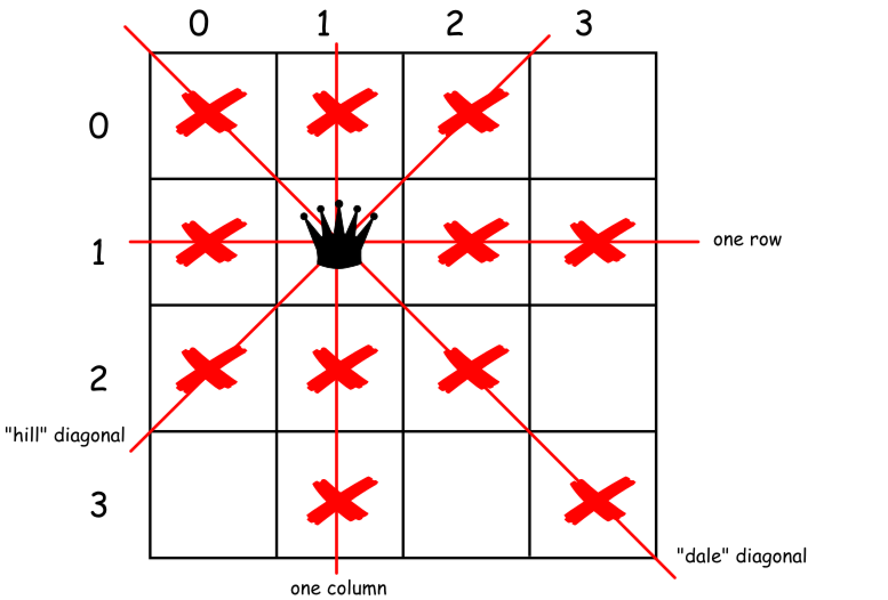
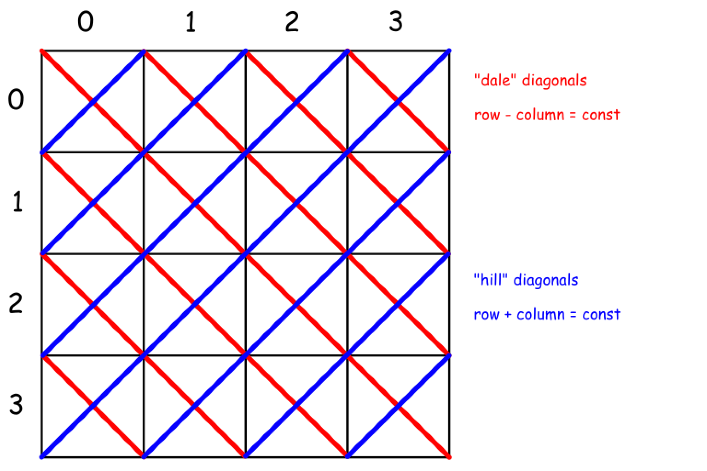

[52. N-Queens II](https://leetcode.com/problems/n-queens-ii/)

* Amazon
* Backtracking
* Similar Questions:
    * [51. N-Queens](https://leetcode.com/problems/n-queens/)
    
Key Points:     
1. The first idea is to use brute-force that means to generate all possible ways
to put `N` queens on the board, and then check them to keep only the combinations
with no queen under attack. This means `O(N^N)` time complexity and hence we'are
forced to think further how to optimize.
2. Related programming conceptions: **constrained programming**. This basically
means to put restrictions after each queen placement. One puts a queen on the board
and that immediately excludes one column, one row and two diagonals. 
也就是在每次放置一个queen之后添加一定的限制。 
3. Related programming conceptions: **backtracking**. 

## Method 1. Backtracking
> Two tips:
> 1. There could be the only one queen in a row and the only one queen in a column.
> That means that there is no need to consider all squares on the board. One could
> just iterate over the columns. 也就是在每行、每列上有且仅有一个 queen。
> 2. For all "hill" diagonals `row + column = const`, and for all "dale" diagonals
> `row - column = const`.
> 3. Backtracking algorithm function: `backtrack(row=0, count=0)`
>   * Start from the first `row = 0`;
>   * Iterate over the columns and try to put a queen in each `col`:
>       * If square `(row, column)` is not under attack
>           * Place the queen in `(row, col)` square;
>           * Exclude one row, one column and two diagonals from further consideration.
>           * **If** all rows are filled up, i.e. `row == N`
>               * That means that we find out one more solultion, count++;
>           * **Else**, i.e. this square is under attack
>               * Proceed to place further queens `backtrack(row+1, count)`
>           * Now backtrack: remove the queen from `(row, col)` square.

|  |
|---|
| Fig 1. Constrained Programming |

|  |
|---|
| Fig 2. Constrained Programming |

```java
class Solution {
    public int totalNQueens(int n) {
        int[] rows = new int[n];
        int[] hills = new int[4 * n - 1];   // hill diagonals
        int[] dales = new int[2 * n - 1];   // dale diagonals
        
        return backtracking(0, 0, n, rows, hills, dales);
    }
    
    private int backtracking(int row, int count, int n, int[] rows, int[] hills, int[] dales) {
        for(int col=0; col<n; col++) {
            if(isNotUnderAttack(row, col, n, rows, hills, dales)) {
                // Place queen
                rows[col] = 1;
                hills[row - col + 2 * n] = 1; // hill diagonals
                dales[row + col] = 1;       // dale diagonals
                
                if(row + 1 == n) {  // If a queens are already placed.
                    count++;
                } else {
                    count = backtracking(row + 1, count, n, rows, hills, dales);
                }
                // Remove queen
                rows[col] = 0;
                hills[row - col + 2 * n] = 0;
                dales[row + col] = 0;
            }
        }
        return count;
    }
    
    private boolean isNotUnderAttack(int row, int col, int n, int[] rows, int[] hills, int[] dales) {
        int res = rows[col] + hills[row - col + 2 * n] + dales[row + col];
        return (res == 0) ? true : false;
    }
}
```
Complexity Analysis
1. Time complexity : `O(N!)`. There is `N` possibilities to put the first queen, not more than `N (N - 2)` to put the 
second one, not more than `N(N - 2)(N - 4)` for the third one etc. In total that results in `O(N!)` time complexity.
2. Space complexity : `O(N)` to keep an information about diagonals and rows.


## Reference:
1. [N Queens Problem (number of Solutions)](http://www.ic-net.or.jp/home/takaken/e/queen/)
