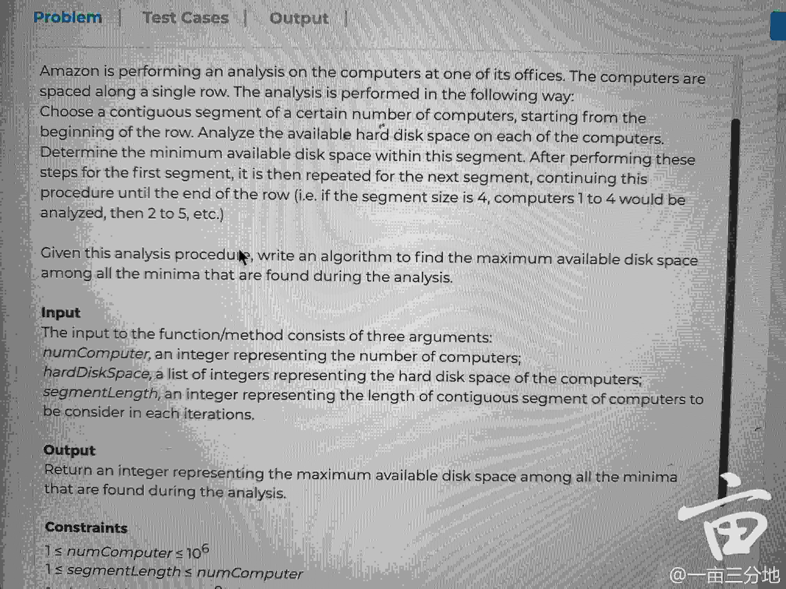
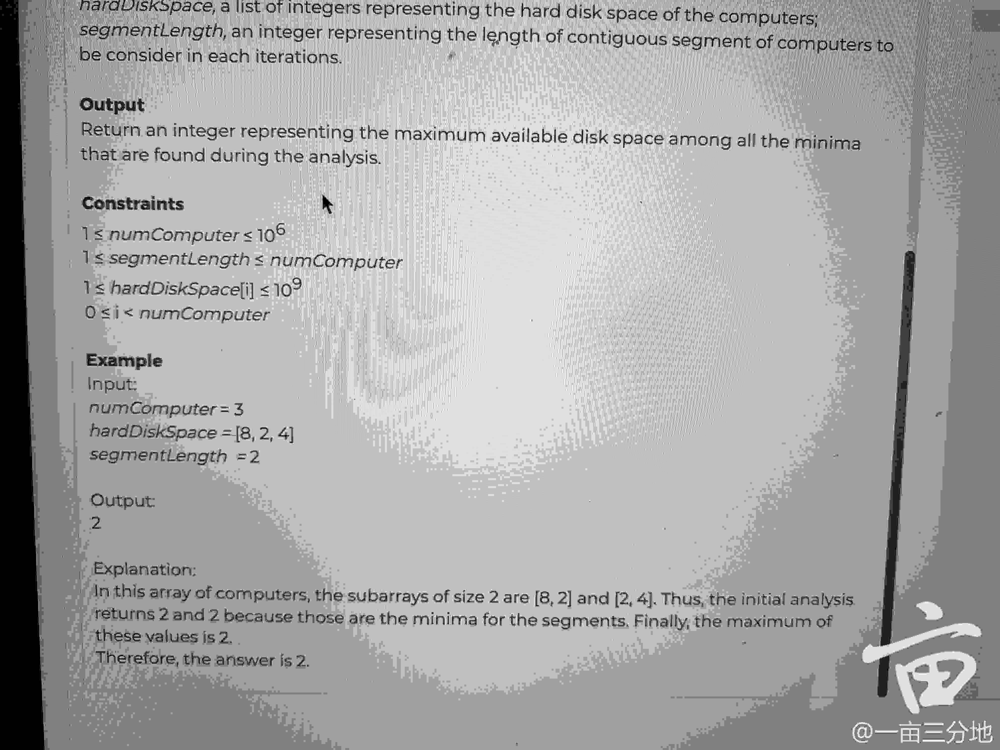

[Amazon | OA 2020 | Disk Space Analysis](https://leetcode.com/discuss/interview-question/808348/)





Input: The input to the function/method consists of 3 arguments:
1. `numComputer`, an integer representing the number of computers;
2. `hardDiskSpace`, a list of integers representing the hard disk space of the computers;
3. `segmentLength`, an integer representing the length of the contiguous segment of computers to be consider in each iterations.

Output:
1. Return an integer representing the maximum available disk space among all the minima that are found during the analysis.

[DiskSpaceAnalysis -- LeetCode Playground](https://leetcode.com/playground/new/empty)
```java
// "static void main" must be defined in a public class.
public class DiskSpaceAnalysis {
    
    public static int maximumMinimumDisk(int numComputer, List<Integer> hardDiskSpace, int segmentLength) {
        // Corner case
        if(numComputer * segmentLength == 0) {
            return 0;
        }
        Deque<Integer> queue = new ArrayDeque<Integer>();
        int res = Integer.MIN_VALUE;
        int[] tmp = new int[numComputer];
        int idx = 0;
        for(int i=0; i<hardDiskSpace.size(); i++) {
            // Remove the idx out of the current block range
            while(!queue.isEmpty() && queue.peek() < i - segmentLength + 1) {
                queue.poll();
            }
            // Only keep possible smallest elements
            while(!queue.isEmpty() && hardDiskSpace.get(queue.peekLast()) >= hardDiskSpace.get(i)) {
                queue.pollLast();
            }
            queue.offer(i);
            if(idx > segmentLength - 1) {
                tmp[idx] = hardDiskSpace.get(queue.peek());
            }
            res = Math.max(res, tmp[idx++]);
            // if(idx > segmentLength - 1 && !queue.isEmpty()) {
            //     res = Math.max(res, hardDiskSpace.get(queue.peek()));
            // }
        }
        return res;
    }
    
    public static void main(String[] args) {
        System.out.println("Hello World!");
        List<Integer> hardDiskSpace1 = Arrays.asList(8, 2, 4);
        int max = maximumMinimumDisk(3, hardDiskSpace1, 2);
        System.out.println("Max result: " + max);
    }
}
```

