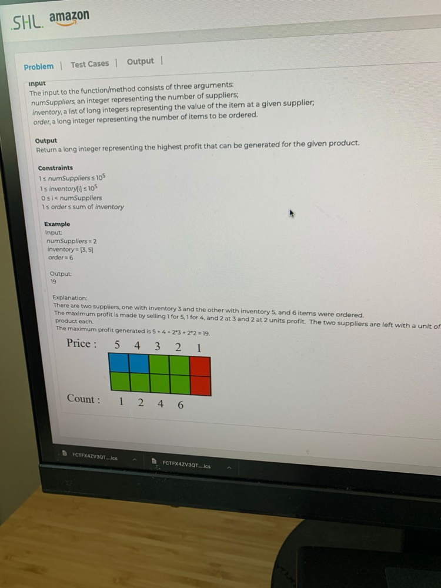

[Highest Profit](https://www.1point3acres.com/bbs/thread-661957-1-1.html)




* Amazon Basics 有一些列供应商(suppliers)为其提供 products。
* 对于每个 product, 库存(the stock)由一个 list 表示，每个 item 表示每个供应商(supplier)提供的数量。
* 每当供应商卖出一个 item 之后，supplier 就涨价 1 个单位。
* Amazon 在每个 item 上的 profit = the number of items the supplier has left.


Inputs:
* `numSuppliers`: an integer representing the number of suppliers
* `inventory`: a list of long integers representing the value of the item at a given supplier
* `order`: a long integer representing the number of items to be ordered

Output:
* Return a long integer representing the highest profit.

Example:
* `numSuppliers = 2`, 有两个 suppliers；
* `inventory = [3, 5]`, 有两个 supplier，第一个 supplier 有 3 个 items，第二个 supplier 有 5 个 items；
* `order = 6`, 

Price:  5  4  3  2  1
count:  0  0  1  1  1
        1  1  1  1  1
order:  1  2  4  6
profit: 5  9 15 19

一个变量维护供应商数， 库存数排序后遍历，让库存数递减到到下一个库存数。
`利润 = 最小(订单, 供应商数) * 库存数;`

1. Sort inventory: [5, 3], 
    库存数 inv = 1, 代表最大库存数 5 只有一个，
    [5, 5, 3, 3, 3]， inv = 2, 代表最大库存书 5 有两个; inv = 5 

## Method 1. My solution

[hight profit - leetcode playground](https://leetcode.com/playground/UqiU8SfZ)
[hight profit - leetcode playground](https://leetcode.com/playground/UqiU8SfZ)

```java
// "static void main" must be defined in a public class.
public class HighestProfit {
    
    public static int highestProfit(int numCustomer, int[] inventory, int order) {
        if(order == 0) {
            return 0;
        }
        
        Arrays.sort(inventory);
        for(int i=0, j=inventory.length-1; i<j; i++, j--) {
            int tmp = inventory[i];
            inventory[i] = inventory[j];
            inventory[j] = tmp;
        }
        // Collections.reverse(inventory);
        int profit = 0;
        while(order > 0) {
            int inv = 0;
            int max = inventory[0];
            for(int i=0; i<Math.min(inventory.length, order); i++) {
                if(inventory[i] == max) {
                    inv++;
                    inventory[i]--;
                }
            }
            profit += Math.min(inv, order) * max;
            order -= inv;
        }
        return profit;
    }
    
    public static void main(String[] args) {
        System.out.println("Hello World!");
        /*
        * Example 1
        *   5, 3 (order = 6)
        *   4, 3 ==> profit=5, (order=5)
        *   3, 3 ==> profit=9, (order=4)
        *   2, 2 ==> profit=15, (order=2)
        *   1, 1 ==> profit=19
        */
        int profit1 = highestProfit(2, new int[]{3, 5}, 6);
        System.out.println("Profit 1: " + profit1);
        
        /*
        * Example 2
        *   5, 5, 5, 3, 3
        *   4, 4, 4, 3, 3  ==> 5 * 3 = 15
        *   3, 3, 3, 3, 3  ==> 15 + 4 * 3 = 27
        */
        int profit2 = highestProfit(5, new int[]{3, 5, 5, 3, 5}, 6);
        System.out.println("Profit 2: " + profit2);
        
        /*
        * Example 3
        *   5, 5, 5, 3, 3 (order = 12)
        *   4, 4, 4, 3, 3  ==> 5 * 3 = 15 (order = 9)
        *   3, 3, 3, 3, 3  ==> 15 + 4 * 3 = 27 (order = 6)
        *   2, 2, 2, 2, 2  ==> 27 + 3 * 5 = 42 (order = 1)
        *   1, 2, 2, 2, 2  ==> 42 + 2 * 1 = 44 (order = 0)
        */
        int profit3 = highestProfit(5, new int[]{3, 5, 5, 3, 5}, 12);
        System.out.println("Profit 3: " + profit3);
    }
}
```


## Method 2. With PriorityQueue
[Amazon-HighestProfit_with_PriorityQueue](https://leetcode.com/playground/UqiU8SfZ)
```java
// "static void main" must be defined in a public class.
public class HighestProfit_PriorityQueue {
    
    public static int highestProfit(int numCustomer, int[] inventory, int order) {
        Queue<Integer> queue = new PriorityQueue<>((a, b) -> Integer.compare(b, a));
        for(int inv: inventory) {
            queue.offer(inv);
        }
        
        int profit = 0;
        while(order > 0 && !queue.isEmpty()) {
            int inv = queue.poll();
            profit += inv;
            inv--;
            if(inv > 0) {
                queue.offer(inv);
            }
            order--;
        }
        return profit;
    }
    // The following code works.
//     public static int highestProfit(int numCustomer, int[] inventory, int order) {
//         Queue<Integer> queue = new PriorityQueue<>();
//         for(int inv: inventory) {
//             queue.offer(inv * (-1));
//         }
        
//         int profit = 0;
//         while(order > 0 && !queue.isEmpty()) {
//             int inv = queue.poll();
//             profit += (-inv);
//             inv++;
//             if(inv < 0) {
//                 queue.offer(inv);
//             }
//             order--;
//         }
//         return profit;
//     }
    
    public static void main(String[] args) {
        System.out.println("Hello World!");
        /*
        * Example 1
        *   5, 3 (order = 6)
        *   4, 3 ==> profit=5, (order=5)
        *   3, 3 ==> profit=9, (order=4)
        *   2, 2 ==> profit=15, (order=2)
        *   1, 1 ==> profit=19
        */
        int profit1 = highestProfit(2, new int[]{3, 5}, 6);
        System.out.println("Profit 1: " + profit1);
        
        /*
        * Example 2
        *   5, 5, 5, 3, 3
        *   4, 4, 4, 3, 3  ==> 5 * 3 = 15
        *   3, 3, 3, 3, 3  ==> 15 + 4 * 3 = 27
        */
        int profit2 = highestProfit(5, new int[]{3, 5, 5, 3, 5}, 6);
        System.out.println("Profit 2: " + profit2);
        
        /*
        * Example 3
        *   5, 5, 5, 3, 3 (order = 12)
        *   4, 4, 4, 3, 3  ==> 5 * 3 = 15 (order = 9)
        *   3, 3, 3, 3, 3  ==> 15 + 4 * 3 = 27 (order = 6)
        *   2, 2, 2, 2, 2  ==> 27 + 3 * 5 = 42 (order = 1)
        *   1, 2, 2, 2, 2  ==> 42 + 2 * 1 = 44 (order = 0)
        */
        int profit3 = highestProfit(5, new int[]{3, 5, 5, 3, 5}, 12);
        System.out.println("Profit 3: " + profit3);
    }
}
```