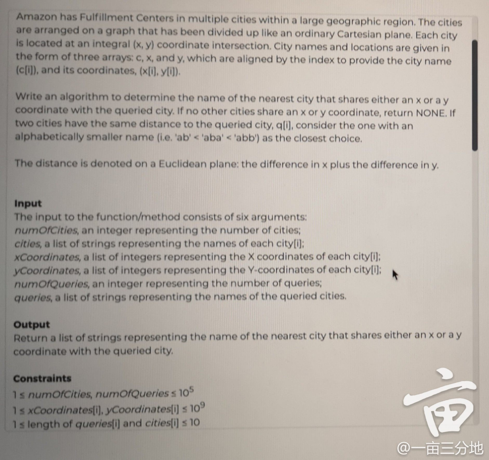

[Nearest Cities](https://leetcode.com/discuss/interview-question/808374/)
[一亩三分地 - 面经](https://www.1point3acres.com/bbs/thread-661422-1-1.html)




Input：
1. `numOfCities`, an integer representing the number of cities;
2. `cities`, a list of strings representing the names of each city[i];
3. `xCoordinates`, a list of integers representing the X-coordinates of each city[i];
4. `yCoordinates`, a list of integers representing the Y-coordinates of each city[i];
5. `numOfQueries`, an integer representing the number of queries;
6. `queries`, a list of strings representing the names of the queried cities.

Output
* Return a list of strings representing the name of the nearest city that shares either an x or a y coordinate with the queried city.

[Playground](https://leetcode.com/playground/new/empty)
```java
// "static void main" must be defined in a public class.
public class NearestCities {
    public static String[] nearestDistance(String[] cities, int[] xs, int[] ys, String[] queries) {
        String[] res = new String[queries.length];
        Map<Integer, TreeMap<Integer, String>> xMap = new HashMap<>();
        Map<Integer, TreeMap<Integer, String>> yMap = new HashMap<>();
        Map<String, int[]> nodeMap = new HashMap<>();
        
        for(int i=0; i<cities.length; i++) {
            nodeMap.put(cities[i], new int[]{xs[i], ys[i]});    // city i and its xy position
            xMap.putIfAbsent(xs[i], new TreeMap<>());
            yMap.putIfAbsent(ys[i], new TreeMap<>());
            xMap.get(xs[i]).put(ys[i], cities[i]);
            yMap.get(ys[i]).put(xs[i], cities[i]);
        }
        
        for(int i=0; i<queries.length; i++) {
            int[] node = nodeMap.get(queries[i]);
            TreeMap<Integer, String> ym = xMap.getOrDefault(node[0], new TreeMap<>());
            TreeMap<Integer, String> xm = yMap.getOrDefault(node[1], new TreeMap<>());
            Integer yl = ym.lowerKey(node[1]);
            Integer yh = ym.higherKey(node[1]);
            Integer xl = xm.lowerKey(node[0]);
            Integer xh = xm.higherKey(node[0]);
            int dist = Integer.MAX_VALUE;
            if(yl != null && Math.abs(yl - node[1]) <= dist) {
                dist = Math.abs(yl - node[1]);
                res[i] = (res[i] == null) ? ym.get(yl) : res[i].compareTo(ym.get(yl)) > 0 ? ym.get(yl) : res[i];
            }
            if(yh != null && Math.abs(yh - node[1]) <= dist) {
                res[i] = (res[i] == null) ? ym.get(yh) : res[i].compareTo(ym.get(yh)) > 0 ? ym.get(yh) : res[i];
            }
            if(xl != null && Math.abs(xl - node[0]) <= dist) {
                res[i] = (res[i] == null) ? xm.get(xl) : res[i].compareTo(xm.get(xl)) > 0 ? xm.get(xl) : res[i];
            }
            if(xh != null && Math.abs(xh - node[0]) <= dist) {
                res[i] = (res[i] == null) ? xm.get(xh) : res[i].compareTo(xm.get(xh)) > 0 ? xm.get(xh) : res[i];
            }
            if(res[i] == null) {
                res[i] = "None";
            }
        }
        return res;
    }
    
    public static void main(String[] args) {
        System.out.println("Hello World!");
        String[] cities1 = {"c1", "c2", "c3"};
        int[] xs = {3, 2, 1};
        int[] ys = {3, 2, 3};
        String[] queries = {"c1", "c2", "c3"};
        System.out.println(Arrays.toString(nearestDistance(cities1, xs, ys, queries)));
    }
}
```


