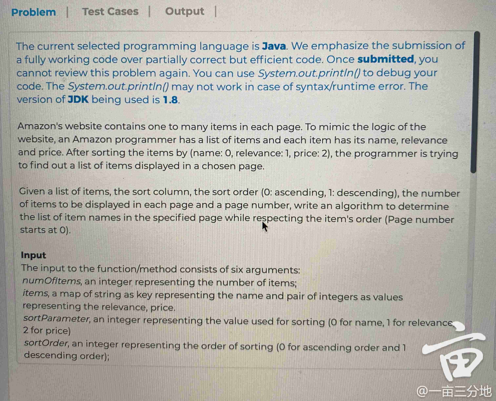

[Amazon | OA2 | Pagination (分页) | New Grad 2021](https://leetcode.com/discuss/interview-question/801590/)

* Sort results based on one of any of the defined attributes;
* Break the result up into pages and return only the requested page.




Six arguments:
* `numOfItems`: an integer;
* `items`: a map with item names as keys with a list of pair of integers -- relevance and price of the item;
* `sortParameter`: an integer representing the value used for sorting (0 for name, 1 for relevance, 2 for price);
* `sortOrder`: 0 for ascending and 1 for descending;
* `itemsPerPage`: an integer, always greater than 0 and less than the minimum of `numOfItems` and 20, i.e. `0 < itemsPerPage < Math.min(20, numOfItems)`;
* `pageNumber`: an integer representing the page number to display item names.


## Method 1. [Ref](https://leetcode.com/discuss/interview-question/801590/Amazon-or-OA2-or-Pagination/663340)
[pagination - leetcode - playground](https://leetcode.com/playground/aZX3bQnJ)

```java
// "static void main" must be defined in a public class.
import java.util.ArrayList;
import java.util.HashMap;
import java.util.List;
import java.util.PriorityQueue;

public class Pagination {
    
    public static List<String> fetchItemsToDisplay(int numOfItems, 
                                                  HashMap<String, PairInts> items,
                                                  int sortParameter,
                                                  int sortOrder,
                                                  int itemsPerPage,
                                                  int pageNumber) {
        List<List<String>> listOfItems = new ArrayList<>();
        
        PriorityQueue<String> queue = new PriorityQueue<>((a, b) -> {
            if(sortParameter == 0) {        // Sort by name
                if(sortOrder == 0) {    // Asecending order
                    return a.compareTo(b);
                } else {
                    return b.compareTo(a);
                }
            } else if(sortParameter == 1) { // Sort by relevance.
                if(sortOrder == 0) {    // Asecending order
                    return items.get(a).relevance - items.get(b).relevance;
                } else {
                    return items.get(b).relevance - items.get(a).relevance;
                }
            } else {                    // Sort by name
                if(sortOrder == 0) {    // Asecending order
                    return items.get(a).price - items.get(b).price;
                } else {
                    return items.get(b).price - items.get(a).price;
                }
            }
        });
        
        queue.addAll(items.keySet());
        
        int currPage = 0;
        int currItemNumber = 0;
        listOfItems.add(new ArrayList<>());
        while(!queue.isEmpty()) {
            String tmp = queue.poll();
            if(currItemNumber == itemsPerPage) {    // Add a new Page
                listOfItems.add(new ArrayList<>());
                currPage++;
                currItemNumber = 0;
            }
            listOfItems.get(currPage).add(tmp);
            currItemNumber++;
        }
        
        if(pageNumber >= listOfItems.size()) {
            return new ArrayList<>();
        }
        return listOfItems.get(pageNumber);
    }
    
    public static void main(String[] args) {
        System.out.println("Hello World!");
        HashMap<String, PairInts> map = new HashMap<>();
        map.put("item1", new PairInts(10, 15));
        map.put("item2", new PairInts(3, 4));
        map.put("item3", new PairInts(17, 8));
        System.out.println(fetchItemsToDisplay(3, map, 2, 1, 2, 1));
    }
}

class PairInts {
    int relevance;
    int price;
    
    public PairInts(int relevance, int price) {
        this.relevance = relevance;
        this.price = price;
    }
}
```

Complexity:
1. Time: O(NlogN), 
2. Space: O(N), because we need to add everything to the heap.


