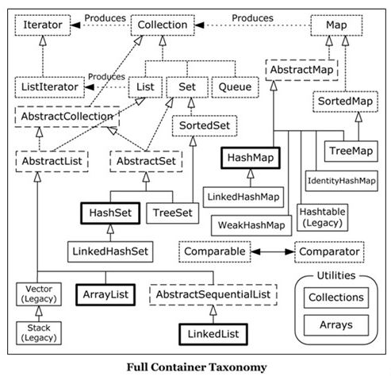

* Stack
> The **Stack** class represents a `last-in-first-out(FILO)` stack of objects. 
> It extends class **Vector** with five operations that allow a vector to be treated as a stack.
> * `public E push(E item)`
> * `public E pop()`
> * `public E peek()`
> * `public boolean empty()`
> * `public int search(Object o)`

* As specified int the [Stack JavaDocs](https://docs.oracle.com/javase/8/docs/api/java/util/Stack.html), it's recommended to use `Deque` interface:
    * `Deque<TreeNode> stack = new ArrayDeque<>()`
    * Always use ArrayDeque instead of Stack and the regular Queue.

* LinkedList
> Doubly-linked list implementation of the List and Deque interfaces. Implements all optional list operations, and permits all elements (including null). 
>

## Reference:
1. [【Java基础】 (List、Set、Map、Stack、Queue）总结](https://blog.csdn.net/yuanmxiang/article/details/51132499)
2. [Simple Java solution using a stack with explanation](https://leetcode.com/problems/flatten-nested-list-iterator/discuss/80147/Simple-Java-solution-using-a-stack-with-explanation/165585)

