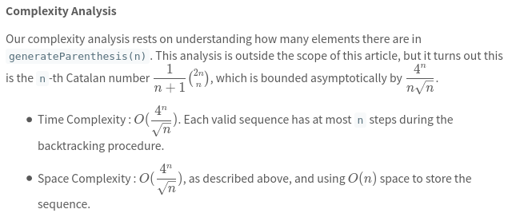

[22. Generate Parentheses](https://leetcode.com/problems/generate-parentheses/)

* Facebook, Amazon, Microsoft, Adobe, Walmart Labs, Google, Apple, ByteDance, Spotify, Yandex, Cisco, Atlassian
* String, Backtracking
* Similar Questions:
    * [20. Valid Parentheses](https://leetcode.com/problems/valid-parentheses/)
    * [17. Letter Combinations of a Phone Number](https://leetcode.com/problems/letter-combinations-of-a-phone-number/)
    
    
## Method 1. Backtracking
> Only add '(' or ')' when we know it will remain a valid sequence.
> We can do this by keeping track of the number of opening and closing brackets we have placed so far.          
> 
```java
class Solution {
    public List<String> generateParenthesis(int n) {
        List<String> res = new ArrayList<String>();
        if(n == 0) {
            return res;
        }
        generateParenthesis(new StringBuilder(), 0, 0, n, res);
        return res;
    }
    
    private void generateParenthesis(StringBuilder sb, int left, int right, int n, List<String> res) {
        if(left < right) {
            return;
        }
        if(left==n && right==n) {
            res.add(sb.toString());
            return;
        }
        int len = sb.length();
        if(left < n) {
            generateParenthesis(sb.append('('), left+1, right, n, res);
        }
        sb.setLength(len);  // Append '(' or ')', so we need to reset length
        if(right < n) {
            generateParenthesis(sb.append(')'), left, right+1, n, res);
        }
    }
}
```



## My Solution -- Backtracking
Key Points:
1. Constraint Condition: 
    * `left > n` || `right > n` || `right > left`, invalid parenthesis, directly return.
    * Set to original left before backtracking, since when `left == right == n`, `sb` will not set to original length.
```java
class Solution {
    public List<String> generateParenthesis(int n) {
        List<String> res = new ArrayList<>();
        
        backtracking(n, 0, 0, new StringBuilder(), res);
        return res;
    }
    
    private void backtracking(int n, int left, int right, StringBuilder sb, List<String> res) {
        if(left > n || right > n || right > left) {
            return;
        }
        if(left == n && right == n) {
            res.add(sb.toString());
            return;
        }
        
        int len = sb.length();
        backtracking(n, left+1, right, sb.append("("), res);
        sb.setLength(len);  // set to original left before backtracking, since when `left == right == n`, `sb` will not set to original length.
        backtracking(n, left, right+1, sb.append(")"), res);
    }
}
```

