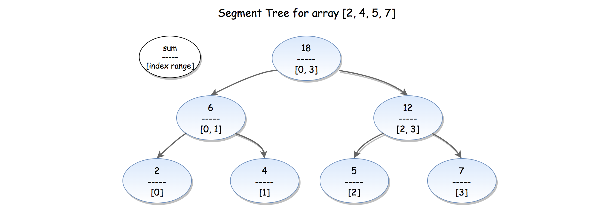

[307. Range Sum Query - Mutable](https://leetcode.com/problems/range-sum-query-mutable/)

* Google
* Binary Indexed Tree, Segment Tree
* Similar Questions:
    * 303.Range Sum Query - Immutable
    * 308.Range Sum Query 2D - Mutable
    
    
## Method 1. Naive
```java
class NumArray {

    private int[] nums;
    public NumArray(int[] nums) {
        this.nums = nums;
    }
    
    public void update(int i, int val) {
        nums[i] = val;
    }
    
    public int sumRange(int i, int j) {
        int sum = 0;
        for(int l=i; l<=j; l++) {
            sum += nums[l];
        }
        return sum;
    }
}
```
Complexity:
1. Time complexity : `O(n)` - range sum query, `O(1)` - update query
2. Space complexity : `O(1)`.


## Method 2. [Segment Tree](https://leetcode.com/problems/range-sum-query-mutable/solution/)
Segment tree is a very flexible data structure, because it is used to solve numerous range query problems like finding **minimum**, **maximum**, **sum**, **greatest common divisor**, **least commom denominator** in array in logarithmic time.


Key Points:
1. For an array implementation, if the element at index `i` is not a leaf, its left and right child are stored at index `2i` and `2i+1` respectively.


Segment Tree can be broken down to the three following steps:
1. Pre-processing step which builds the segment tree from a given array;
2. Update the segment tree when an element is modified;
3. Calculate the Range Sum Query using the segment tree.

* If some node `p` holds the sum of `[i,...,j]` range, its left and right children hold the sum for range `[i, ..., (i+j)/2]` and `[(i+j)/2 + 1, ..., j]` respectively.
Therefore, in order to find the sum of node `p`, we need to calculate the sum of its left and right child in advance.

```java
class NumArray {

    private int[] tree;
    private int n;
    public NumArray(int[] nums) {
        if(nums.length > 0) {
            n = nums.length;
            tree = new int[2 * n];
            buildTree(nums);
        }
    }
    
    public void update(int i, int val) {
        i += n;
        tree[i] = val;
        while(i > 0) {
            int left = i;
            int right = i;
            if(i % 2 == 0) {
                right = i + 1;
            } else {
                left = i - 1;
            }
            // Parent is updated after child is updated
            tree[i / 2] = tree[left] + tree[right];
            i /= 2;
        }
    }
    
    public int sumRange(int i, int j) {
        // Get leaf with the value 'l'
        i += n;
        // Get leaf with the value 'r'
        j += n;
        int sum = 0;
        while(i <= j) {
            if(i % 2 == 1) {
                sum += tree[i];
                i++;
            }
            if(j % 2 == 0) {
                sum += tree[j];
                j--;
            }
            i /= 2;
            j /= 2;
        }
        return sum;
    }
    
    private void buildTree(int[] nums) {
        for(int i=n, j=0; i<2*n; i++, j++) {
            tree[i] = nums[j];
        }
        for(int i=n-1; i>0; i--) {
            tree[i] = tree[2*i] + tree[2*i+1];
        }
    }
}

/**
 * Your NumArray object will be instantiated and called as such:
 * NumArray obj = new NumArray(nums);
 * obj.update(i,val);
 * int param_2 = obj.sumRange(i,j);
 */
```


