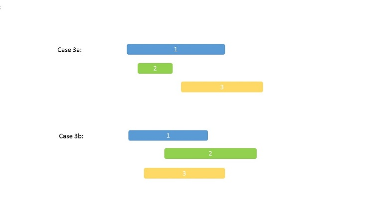

[435. Non-overlapping Intervals](https://leetcode.com/problems/non-overlapping-intervals/)

* Facebook, Google, Amazon
* Greedy
* Similar Questions:
    * 452.Minimum Number of Arrows to Burst Balloons

## Method 1. DP
Key Points:
1. Use `dp[i]` stores the maximum number of valid intervals that can be included in the final list if the interval upto the `i-th` interval only are considered, including itself.
也就是 `dp[i]` 保存从在 `[0, i]` 之间可能共存的最多 intervals。
2. For `dp[i+1]`, we need to consider the maximum of all `dp[j]` such that `j<=i` and `j-th` interval and `(i+1)th` interval don't overlap.
3. `dp[i+1] = max(dp[j]) + `, such that `j-th` interval and `i-th` don't overlap, for all `j <= i`.
```java
class Solution {
    public int eraseOverlapIntervals(int[][] intervals) {
        if(intervals == null || intervals.length == 0) {
            return 0;
        }
        Arrays.sort(intervals, (a, b) -> (a[0] - b[0]));    // Sort by start time
        int[] dp = new int[intervals.length];
        dp[0] = 1;  // If there is only one interval, we can keep the only one interval
        int res = 1;
        for(int j=1; j<dp.length; j++) {
            int max = 0;
            for(int i=j-1; i>=0; i--) {
                if(intervals[i][1] <= intervals[j][0]) {
                    max = Math.max(max, dp[i]);
                }
            }
            dp[j] = max + 1;
            res = Math.max(res, dp[j]);
        }
        return intervals.length - res;
    }
}
```
Complexity Analysis
1. Time complexity : `O(n^2)`. Two nested loops are required to fill `dp` array.
2. Space complexity : `O(n)`. `dp` array of size nnn is used.


## Method 2. [Using Greedy Approach based on startng points](https://leetcode.com/problems/non-overlapping-intervals/solution/)


Key Points:
1. The two intervals currently considered are non-overlapping: we need not remove any interval and just assigning the *prev* pointer to the later interval;
2. The two intervals currently considered are overlapping and the end point of the later interval falls before the end point of the previous interval: Remove the larger interval, i.e. remove the previous interval and assigning the *prev* pointer to the later interval;
3. The two intervals currently considered are overlapping and the end point of the later interval falls after the end point of the previous interval: Remove the larger interval, i.e. remove the previous interval and assigning the *prev* pointer to the later interval;
```java
class Solution {
    public int eraseOverlapIntervals(int[][] intervals) {
        if(intervals == null || intervals.length == 0) {
            return 0;
        }
        
        Arrays.sort(intervals, (a, b) -> (a[0] - b[0]));
        int end = intervals[0][1];
        int prev = 0;
        int count = 0;
        for(int i=1; i<intervals.length; i++) {
            if(intervals[prev][1] > intervals[i][0]) {  // has overlapping
                if(intervals[prev][1] > intervals[i][1]) {  // [a1, [a2, b2], b1] ==> remove [a1, b1], prev points to [a2, b2]
                    prev = i;   // Remove the previous interval and keep the later interval, i.e. i-th interval   
                }
                count++;    
            } else {
                prev = i;   // Keep both `prev` and `i-th` intervals, just update `prev` pointer
            }
        }
        return count;
    }
}
```
Complexity Analysis
1. Time complexity : O(nlog(n)). Sorting takes O(nlog(n)) time.
2. Space complexity : O(1). No extra space is used.


## Method 3. Using Greedy Approach based on end points [Accepted]
>  For this, firstly we sort the given intervals based on the end points. 
> Then, we traverse over the sorted intervals. 
> While traversing, if there is no overlapping between the previous interval and the current interval, we need not remove any interval. 
> But, if an overlap exists between the previous interval and the current interval, we always drop the current interval.
```java
class Solution {
    public int eraseOverlapIntervals(int[][] intervals) {
        if(intervals == null || intervals.length == 0) {
            return 0;
        }
        
        Arrays.sort(intervals, (a, b) -> (a[1] - b[1]));
        int end = intervals[0][1];
        int count = 0;
        for(int i=1; i<intervals.length; i++) {
            if(intervals[i][0] < end) { // remove intervals[i], end is still the previous intervals[j][1]
                count++;
            } else {
                end = intervals[i][1];
            }
        }
        return count;
    }
}
```
Complexity Analysis
1. Time complexity : O(nlog(n)). Sorting takes O(nlog(n)) time.
2. Space complexity : O(1). No extra space is used.


## Method 4. [Java: Least is Most](https://leetcode.com/problems/non-overlapping-intervals/discuss/91713/Java%3A-Least-is-Most)
The problem is: Given a collection of intervals, find the maximum number of intervals that are non-overlapping.  ==> The classic Greedy Problem: [Interval Scheduling](https://en.wikipedia.org/wiki/Interval_scheduling#Interval_Scheduling_Maximization)
```java
class Solution {
    public int eraseOverlapIntervals(int[][] intervals) {
        if(intervals == null || intervals.length == 0) {
            return 0;
        }
        
        Arrays.sort(intervals, (a, b) -> (a[1] - b[1]));
        int end = intervals[0][1];
        int count = 1;  // The amount of intervals that we can keep
        for(int i=1; i<intervals.length; i++) {
            if(intervals[i][0] >= end) {    // intervals[i] has no overlapping with the previous one, thus we can keep it
                count++;
                end = intervals[i][1];
            }
        }
        return intervals.length - count;
    }
}
```


## Reference:
1. [Short Ruby and Python](https://leetcode.com/problems/non-overlapping-intervals/discuss/91721/Short-Ruby-and-Python/397810)

