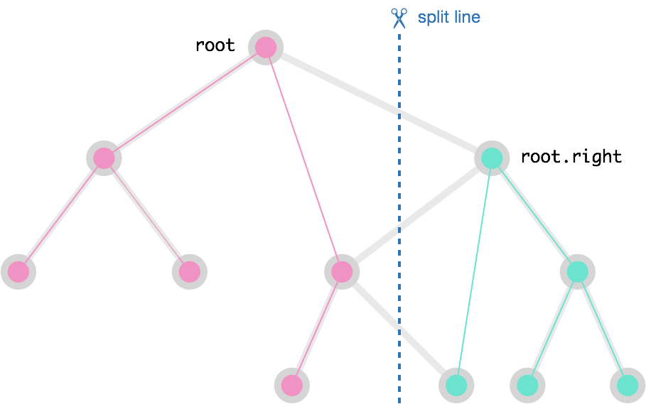

[776. Split BST](https://leetcode.com/problems/split-bst/)

* Google, Facebook
* Tree, Recursion
* Similar Questions:
    * 450.Delte Node in BST
* Hints:
    * Use recursion. If `root.val <= V`, you split `root.right` into two havles, then join it's left half back on root.right.


* It's not necessarily the case that the tree contains a node with value 'V'. [树中可能不含有 target value `V`]
* `All values of subtree1 <= V` and `All values of subtree2 > V`


Analysis：
1. If `node.val == v`, 则从该 node 开始分割，用 `node.right` replace `node`.
2. If `node.val < v && v < node.right.val`, the same with above.
3. If `v < node.val && node.left.val < v`  
    
    
## Method 1. Recursion
1. If `root.val <= V`, then some nodes in `root.right` subtree may still contain some nodes, which value less or equal than V.
2. If `root.val > V`, then some nodes in `root.left` subtree may still contain some nodes, which value larger than V.

```java 
class Solution {
    public TreeNode[] splitBST(TreeNode root, int V) {
        if(root == null) {
            return new TreeNode[]{null, null};
        } else if(root.val <= V) {  // all nodes including node.left and node are smaller than V
            TreeNode[] res = splitBST(root.right, V);
            root.right = res[0];
            res[0] = root;
            return res;
        } else {    
            TreeNode[] res = splitBST(root.left, V);
            root.left = res[1];
            res[1] = root;
            return res;
        }
    }
}
``` 
Complexity Analysis

    Time Complexity: O(N), where N is the number of nodes in the input tree, as each node is checked once.
    Space Complexity: O(N).


